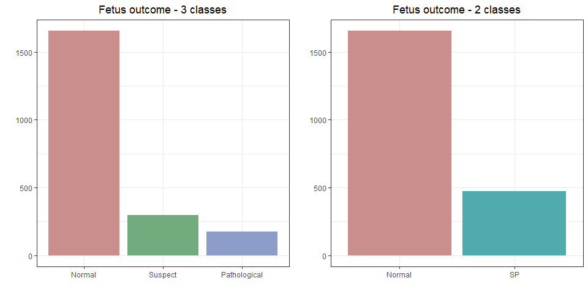

Fetal Health Prediction
================

## Data

This dataset contains **2126** records of features extracted from *Cardiotocogram exams*, which were then classified by three expert obstetritians into 3 classes:

-   **Normal**: `fetal_health = 1`
-   **Suspect**: `fetal_health = 2`
-   **Pathological**: `fetal_health = 3`

From the plot we can see how the classes are unbalanced, in order to solve this problem we collapse the classes `2` and `3` in a new class called `SP` (Suspect/Pathological):

``` r
do.call("grid.arrange", c(list(C3,C2), ncol=2))
```



The variables that we use for the model are the following:

-   **baseline value:** Baseline Fetal Heart Rate (FHR) (beats per minute)
-   **accelerations:** Number of accelerations per second
-   **fetal\_movement:** Number of fetal movements per second
-   **uterine\_contractions:** Number of uterine contractions per second
-   **light\_decelerations:** Number of light decelerations (LDs) per second
-   **severe\_decelerations:** Number of severe decelerations (SDs) per second
-   **prolongued\_decelerations:** Number of prolonged decelerations (PDs) per second
-   **abnormal\_short\_term\_variability:** Percentage of time with abnormal short term variability
-   **mean\_value\_of\_short\_term\_variability:** Mean value of short term variability
-   **percentage\_of\_time\_with\_abnormal\_long\_term\_variability:** Percentage of time with abnormal long term variability
-   **mean\_value\_of\_long\_term\_variability:** Mean value of long term variability
-   **histogram\_width:** Width of histogram made using all values from a record
-   **histogram\_min:** Histogram minimum value
-   **histogram\_max:** Histogram maximum value
-   **histogram\_number\_of\_peaks:** Number of peaks in the exam histogram
-   **histogram\_number\_of\_zeroes:** Number of zeros in the exam histogram
-   **histogram\_mode:** Histogram mode
-   **histogram\_mean:** Histogram mean
-   **histogram\_median:** Histogram median
-   **histogram\_variance:** Histogram variance
-   **histogram\_tendency:** Histogram tendency

## Model

We use a *Random Forest* from the `randomForestSRC` package. First we split the dataset in train (80%) and test (20%).

``` r
set.seed(1990)
train = sample(1:NROW(DT),1700)

rf_model = rfsrc(fetal_health2 ~ ., data = DT[train,-c(22,24),with=F],importance = TRUE)
rf_pred = predict(rf_model,newdata = DT[-train,-c(22:24),with=F])

confusionMatrix(rf_pred$class,DT[-train]$fetal_health2)
```

    ## Confusion Matrix and Statistics
    ## 
    ##               Reference
    ## Prediction     Normal Suspect Pathological
    ##   Normal          324      13            0
    ##   Suspect           4      46            0
    ##   Pathological      0       1           38
    ## 
    ## Overall Statistics
    ##                                          
    ##                Accuracy : 0.9577         
    ##                  95% CI : (0.934, 0.9748)
    ##     No Information Rate : 0.77           
    ##     P-Value [Acc > NIR] : < 2.2e-16      
    ##                                          
    ##                   Kappa : 0.8846         
    ##                                          
    ##  Mcnemar's Test P-Value : NA             
    ## 
    ## Statistics by Class:
    ## 
    ##                      Class: Normal Class: Suspect Class: Pathological
    ## Sensitivity                 0.9878         0.7667             1.00000
    ## Specificity                 0.8673         0.9891             0.99742
    ## Pos Pred Value              0.9614         0.9200             0.97436
    ## Neg Pred Value              0.9551         0.9628             1.00000
    ## Prevalence                  0.7700         0.1408             0.08920
    ## Detection Rate              0.7606         0.1080             0.08920
    ## Detection Prevalence        0.7911         0.1174             0.09155
    ## Balanced Accuracy           0.9276         0.8779             0.99871
